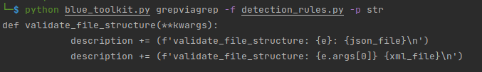
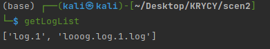

**Autorzy:**
- Borkowski Mateusz
- Gryka Paweł
- Popiołek Paweł
- Wawrzyńczak Michał

# LAB 1a

## Scenariusz 1

|**ID wymagania**|**Opis wymagania**|**Zrzut ekranu z krótkim opisem**|
| :-----------: |:-------------------:| :----:|
| OFF.1 | Opracować aplikację z interfejsem CLI, która pozwoli na realizację wskazanych wymagań. Moduł do tworzenia aplikacji CLI |  |
|      OFF.2       | Aplikacja działania w trybie CLI z wypisywaniem akcji |  |
| OFF.2.1 | Automatycznie tworzony jest log z działania o nazwie składającej się z nazwy aplikacji oraz znacznika czasu jej uruchomienia |  |
| OFF.2.2 | Efekty operacji są wypisywane jednocześnie na CLI oraz do otwartego pliku loga |  |
| OFF.2.3 | Aplikacja utrzymuje także bazę zdarzeń - w bazie danych SQL |  |
| OFF.3 | Aplikacja ma możliwość wskazania pojedynczych plików, folderu lub grupy folderów do przeszukania w poszukiwaniu plików, które mają być wykorzystane do analizy |  |
| OFF.4 | Obsługiwane formaty wejściowe plików do analizy: - pliki tekstowe w formatach .txt , .xml , .json - pliki ze zrzutami ruchu PCAP .pcap - pliki logów Sysmon Windows EVTX - .evtx |  |
| OFF.5 | Aplikacja ma możliwość wyświetlania zawartości pakietów z wczytanych danych z plików PCAP. |  |
| OFF.6 | Aplikacja ma możliwość przekazania filtru zgodnego z formatem BPF (wykorzystywanego przez libpcap / tshark / pyshark / Wireshark / Scapy ) do funkcji otwierającej i wczytującej plik PCAP. |  |
| OFF.7 | Aplikacja ma możliwość wywołania operacji systemowej grep na wskazanych plikach tesktowych. Argumentem przekazywanym do operacji jest właściwe wyrażenie regularne. |  |
| OFF.8 | Aplikacja ma możliwość wywołania działania wyrażenia regularnego z modułu Python re . Argumentem przekazywanym do operacji jest właściwe wyrażenie regularne. |  |
| OFF.9 | Aplikacja ma możliwość załadowania reguł analitycznych do detekcji zdarzeń opisanych za pomocą tych reguł i przechowywania ich w wybranej strukturze danych. |  |
| OFF.9.1 | Reguły będą opisywane jako funkcje Pythona w pliku detection-rules.py (nazwa na sztywno) |  |
| OFF.9.2 | Każda reguła ma być zdefiniowana jako oddzielna funkcja w języku Python we wskzanym pliku w OFF.9.1 . Format pojedynczej reguły: |  |
| OFF.9.3 | Ładowanie reguł ma odbywać się na żądanie, tj. po wywołaniu żądania ładowania - tj. plik z regułami ma nie być załadowany statycznie od początku działania aplikacji OFF.9.4 Każdorazowane wywołanie ładowania reguł ma oznaczać usunięcie i |  |
| OFF.9.4 | Każdorazowe wywołanie ładowania reguł ma oznaczać usunięcie istniejących w pamięci programu i załadowanie nowego zestawu reguł | Tak się dzieje |
| OFF.9.5 | Informacjami zwrotnymi z reguły są: - action_alert - action_block - description |  |
| OFF.10 | Interfejs wywołania reguł analitycznych umożliwa ich użycie w kilku trybach: |  |
| OFF.10.1 | Wywołanie całego zestawu reguł na wybranym zestawie plików |  |
| OFF.10.2 | Wywołanie wybranej reguły - poprzez wskazanie jej nazwy (nazwa funkcji z OFF.9.2 ) - i na wybranym zestawie plików przekazanym do reguły |  |
| OFF.11 | Przygotować aplikację CLI (nie musi być oparta na Click jak w Wymaganiu OFF.1 ) do odbierania wiadomości po REST API i wypisywaniu ich na CLI - alert. |  |
| OFF.12 | Przygotować aplikację CLI (nie musi być oparta na Click jak w Wymaganiu OFF.1) do odbierania wiadomości po REST API i wypisywaniu ich na CLI - akcja dla firewalla. |  |
| OFF.12.1 | \* (opcjonalnie) Można wykonać prostą integrację np. z iptables , ufw czy w inny proponowany sposób z firewallem w wybranym hoście. |  |

## Scenariusz 2

|**ID wymagania**|**Opis wymagania**|**Zrzut ekranu z krótkim opisem**|
| :-----------: |:-------------------:| :----:|
| ON.1 | Opracować oddzielną aplikację od tej w Scenariuszu 1 lub wprowadzić dla niej tryb zarządzania zdalnym agentem na potrzeby analizy online. Moduł do tworzenia aplikacji CLI - Click | Opracowano |
| ON.2 | W ramach architektury rozwiązania wykorzystujemy host z aplikacją główną oraz host z aplikacją agenta. | Tak jest |
| ON.3 | Metodą komunikacji aplikacji głównej z agentem jest REST API. |         Zaimplementowano          |
| ON.MAIN.1.1 | Pobierz informację o konfiguracji sieciowej zdalnego hosta. |  |
| ON.MAIN.1.2 | Zbieraj plik PCAP ze wskazanymi parametrami. Przekazać za pomocą JSON konfigurację zbierania dla wybranej metody zbierania PCAP w agencie. Plik po zebraniu ma być transferowany na host głównej aplikacji |  |
| ON.MAIN.1.3 | Pobieraj listę plików PCAP na zdalnym hoście z agentem. |  |
| ON.MAIN.1.4 | Pobierz wskazany plik lub grupę plików PCAP ze zdalnego hosta z agentem. |  |
| ON.MAIN.2 | Aplikacja ma możliwość wskazania akcji i wykonania jej na zdalnym agencie w zakresie zarządzania plikami logów | Zgadza się |
| ON.MAIN.2.1 | Pobieraj listę plików logów na zdalnym hoście z agentem |  |
| ON.MAIN.2.2 | Pobierz wskazany plik lub grupę plików logów ze zdalnego hosta z agentem. |  |
| ON.MAIN.3 | Aplikacja ma możliwość wskazania akcji systemowej i wykonania jej na zdalnym agencie | Ma możliwość |
| ON.MAIN.3.1 | Zdefiniowanie komendy systemowej do wykonania na zdalnym hoście |  |
| ON.MAIN.3.2 | Przekazanie komendy do wykonania na zdalnym hoście i odebranie odpowiedzi |  |

## Testy

|**ID testu**|**Opis testu**|**Zrzut ekranu z krótkim opisem**|
| :-----------: |:-------------------:| :----:|
| 1 | Prawidłowe wczytywanie każdego z 5 typów danych do analizy. |  |
| 2 | Działanie filtra przy wczytywaniu pliku PCAP. |  |
| 3 | Działanie grep . |  |
| 4 | . Działanie wyrażenia regularnego z modułem re . |  |
| 5 | Wczytanie reguł detekcyjnych z pliku detection-rules.py . |  |
| 6 | Wykonanie reguły detekcyjnej - wszystkich (co najmniej 2), pojedynczej po nazwie. |  |
| 7 | Zaprezentowanie akcji alert-local , alert-remote oraz block . |  |
| 8 | Zdalne uruchomienie zbierania pliku PCAP i pobranie do aplikacji głównej. |  |
| 9 | Zdalne pobranie logów systemowych. |  |
| 10| Zdalne wykonanie komendy systemowej i pobranie jej wyniku do wyświetlenia |  |