# KRYCY LAB 2 - Malware
## Autorzy: Michał Wawrzyńczak, Paweł Gryka
## Stage 1

### Rozpoczęcie
Zgodnie z poleceniem ściągnęliśmy wskazany plik **Faktura.docm** i otworzyliśmy go w Word. Analizę malware rozpoczęliśmy oczywiście od świadomego wciśnięcia przycisku *"zainstaluj wirusa"*. Na szczęście zainstalowany malware nie utrudniał jego analizy a jedynie czasem zabawiał zmianą tapety czy otworzeniem śmiesznego filmiku z kaczką na Youtube. Oczywiście zdajemy sobie sprawę z tego, że w prawdziwej, niekontrolowanej sytuaacji, pod rzadnym pozorem nie powinniśmy byli ani włączyć makra zawartego w złośliwym pliku, ani całkowicie wyłączyć Windows Defendera.

### Właściwa analiza
Zgodnie z wskazówkami z wykładu włączyliśmy w Word tryb dewelopera i otworzyliśmy zakładkę *Visual Basic*. Przywitały nas *"QUACK'i"* wszelkiego rodzaju i długości.
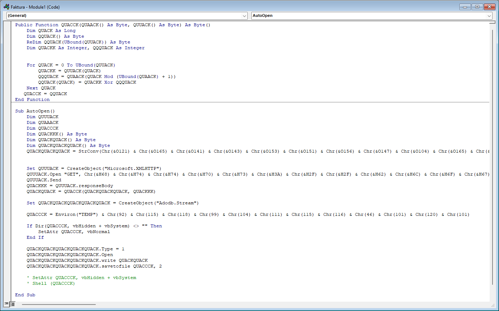
Stwierdziliśmy, że dobrym punktem zaczepienia będzie odkodowanie trzech widocznych łańcuszków *"char'ów"*. By to zrobić przekopiowaliśmy interesujące nas łańcuchy do notatnika i pozbyliśmy się niepotrzebnych znaków. Następnie odkodowaliśmy łańcuchy zakodowane odpowiednio w oct, hex i dec za pomocą cyberchef'a.
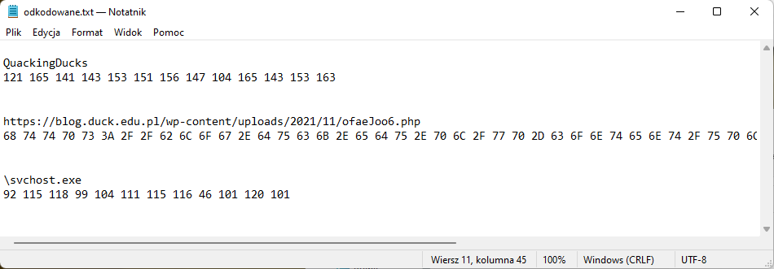
Pobraliśmy plik z otrzymanej strony ale był on zaszyfrowany. Dlatego głębiej przyjrzeliśmy się QUACK'ającemu makru i znaleźliśmy potężny algorytm szyfrujący który używał drugiego znalezionego stringa jako hasła. Jednakże stwierdziliśmy, że nie ma sensu reverse'ować tego dalej żeby odszyfrować plik, skoro makro może to zrobić za nas. Dlatego pobieżnie przeanalizowaliśmy kod i zorientowaliśmy się, że gdy wykomentarzujemy dwie (już pominiemy tutaj nasze załamnie gdy dowiedzieliśmy się jak wygląda komentarz w Visual Basic) ostatnie linijki to otrzymamy odszyfrowany plik o nazwie **"svchost.exe"** zapisany w katalogu Temp. 
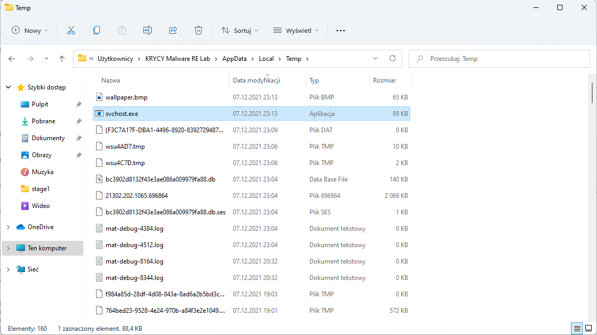

## Stage 2
Sprawdziliśmy linuxowym poleceniem `file` typ pliku
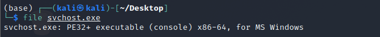

Gdy już otrzymaliśmy skompilowaną binarkę to oczywistym było włączenie Ghidry. Po wcale nie krótkiej walce z skalowaniem ekranu i przyciskiem *"OK"* wystającym za ekran, udało się otrzymać zdekompilowany kod. Należy w tym miejscu zaznaczyć, że kod nie wymagał większej interpretacji i deobfuskacji. Można powiedzieć, że wszystko było podane na tacy. Tutaj ważną wskazówką znowu były linki. Ponownie ściągnęliśmy plik z linku ale (ponownie), był on zaszyfrowany. 
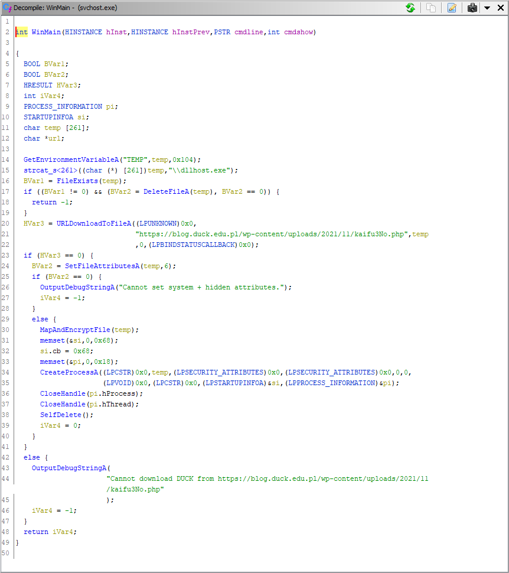

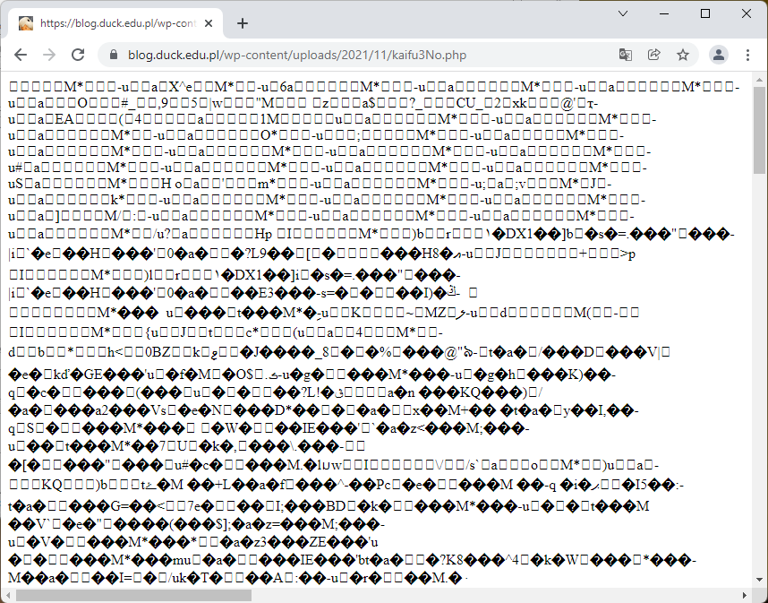

Po krótkiej analzie znaleźliśmy funkcję *MapAndEncryptFile* oraz *VerySecureEncryption*. Wynikało z nich, że w pobranym pliku, pierwsze 16 bajtów to klucz a reszta jest "zaszyfrowana" za pomocą funkcji XOR z tym kluczem.
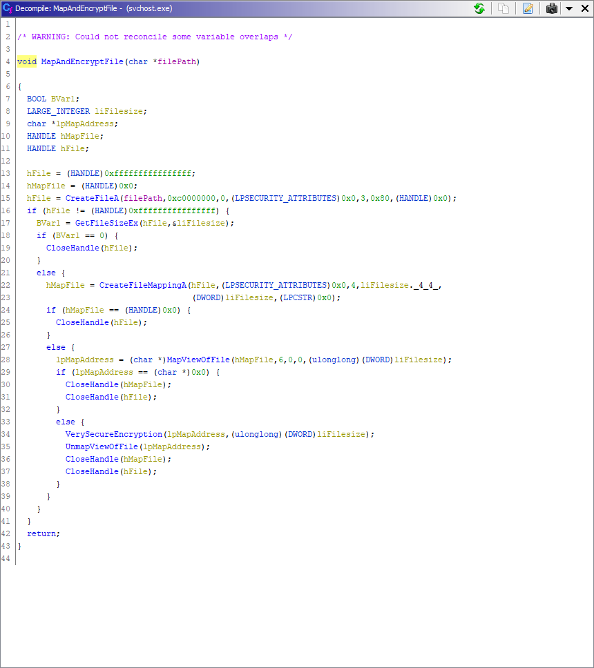

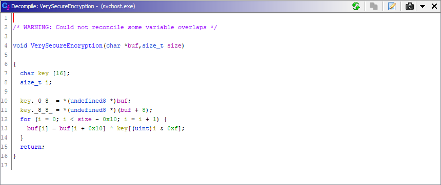

Żeby odszyforwać plik napisaliśmy szybko funkcję w pythonie:
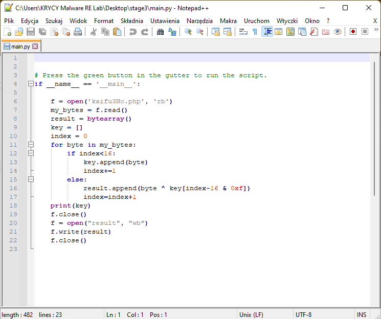

Dzięki, której otrzymaliśmy kolejną, odszyfrowaną binarkę:
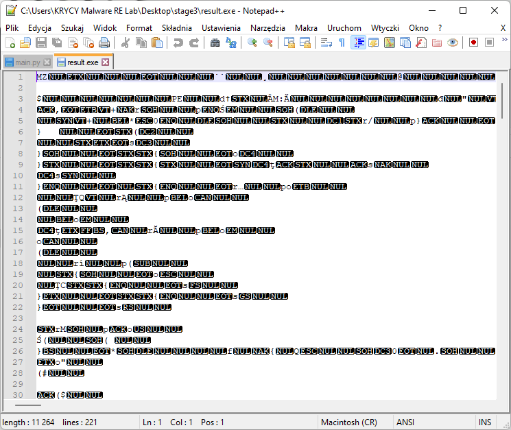

## Stage 3
Sprawdziliśmy linuxowym poleceniem `file` typ pliku.
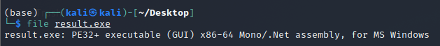

Naspępnym krokie było załadowanie binarki do programu dnSpy, oraz jej analiza. Główną funkcją analizowanego programu było dołączenie do kanału Internet Relay Chat na którym odbywała się komunikacja pomiędzy botami a bot masterem. Następnie nasz program działał w pętli oczekując na polecenia i wysyłając odpowiedzi. Z kodu odało nam się uzyskać nazwę kanału oraz hasło do niego.
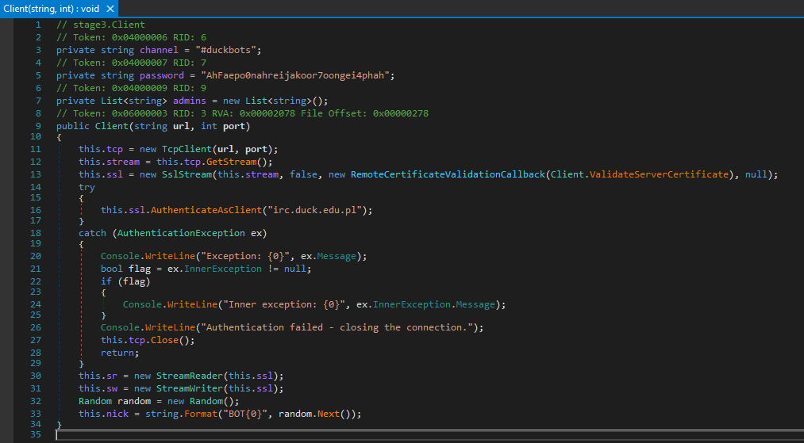

Zalogować się na kanał IRC wykorzystując przeglądarkę.
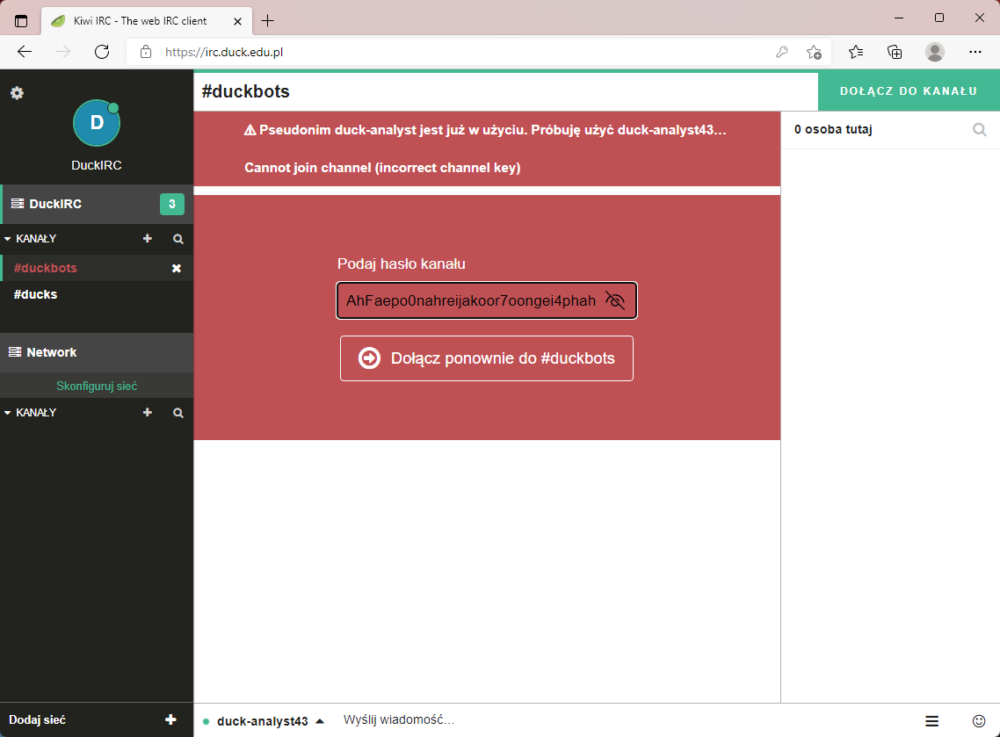

Pierwszym co zobaczyliśmy była komenda od bot mastera wymuszająca zmianę tapety na botach
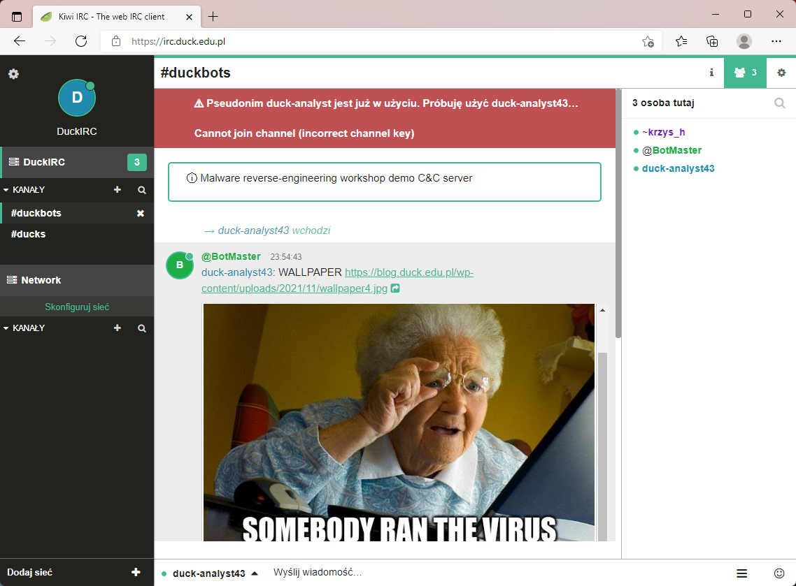

W tym momencie przeszliśmy z analizy statycznej na analizę dynamiczną i postanowiliśmy uruchomić malware w "kontrolowanym" środowisku, obserwując komunikację C2 na kanale IRC #duckbots.

Pierwsze co dzieje się po uruchomieniu malwaru to dołączenie do kanału i zgłoszenie się naszego bota jako aktywny. Bot master wysyła w odowiedzi polecenie uruchamiające konkretną stronę w przeglądarce
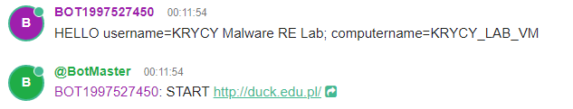

Następnie bot master wysyła polecenie sprawdzające konfiguracje sieciową na bocie. Bot odpowiada.
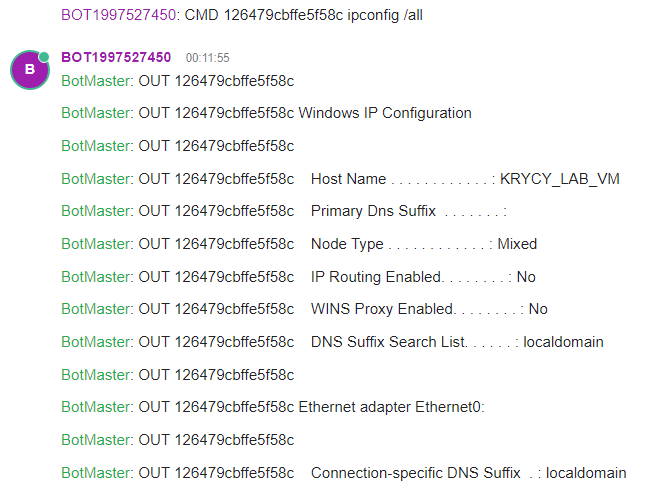

Zauważyliśmy, że *BotMaster* próbuje pobrać z komputerów botów plik `C:\Users\KRYCY Malware RE Lab\AppData\RToaming\Bitcoin\wallet.dat` jednakże ciągle otrzymuje odpowiedź, że taki plik nie istnieje. Sprawdziliśmy i rzeczywiście plik nie istniał, dlatego stworzyliśmy ten plik i wrzuciliśmy do środka link do strony z słodką kaczką. Po żądaniu nasz bot wysyła w base_64 nasz plik

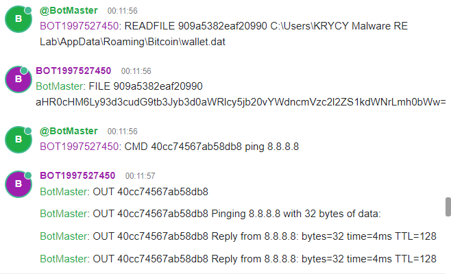

Możliwe komendy wydawane przez bot mastera:
- START
- WALLPAPER
- CMD
- READFILE
- EXIT